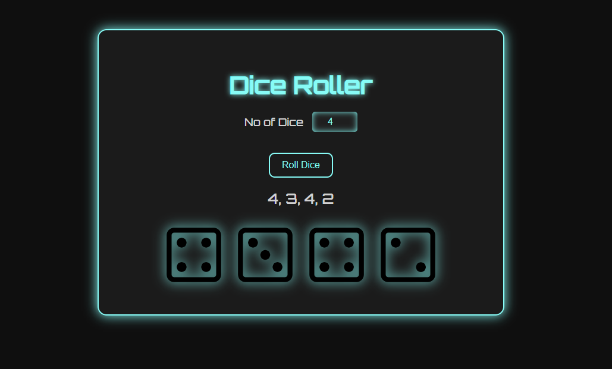

# Dice Roller 🎲

A simple web-based dice roller app built with HTML, CSS, and JavaScript.

## Features

- Roll any number of dice at once
- Futuristic neon UI
- Displays both numeric and visual dice results

## Demo

## How to Use

1. Enter how many dice you want to roll.
2. Click the "Roll Dice" button.
3. See the results and dice images.

## Technologies Used

- HTML
- CSS
- JavaScript

## Author

[Piyush Sagar](https://github.com/Piyush-Sagar)
